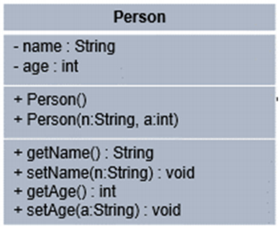
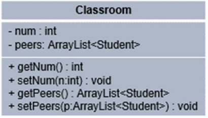

# Covid-19 Campus Tracer

**Names:** Cameron Dolly, Daniel Liew, Fritz Stapfer Paz, Lauren Gietzen, Logo Olagoke

**Class:** CMS 270, Dr. Elva

( I need to figure out how to include images in markdown so until then we won't have images)

## Abstraction

We were asked to simulate a campus tracing system, to determine the spread of a virus throughout the student body. To simulate this, we are making a few assumptions to help with our abstraction:

1. A Student is willing to be tested daily. Results are instant.
2. Because of our fast response, the virus will only infect a Person with 1 degree of separation from an infected Person.
   - If Student “a” is infected, and he was in contact with Student “b”, Student “b” will be quarantined before testing positive.
   - If Student “c” was in contact with Student “b” but not Student “a”, Student “c” was not exposed to the virus.
3. A Person can only be infected once and develops immunity after quarantine period if infected.
4. If a Person is exposed to an infected Person, the Person will be infected with a probability called infection rob.
5. A Stranger has a probability equal to his riskFactor of being infected

Students are constantly at risk for the virus. They have daily interactions with friends, strangers, and other students inside their classrooms, meaning we will need to be testing them daily. This will ensure our Statistics for the CampusTracing object will always be accurate.

The CampusTracing System will be initialized by passing a population of students and will be used daily to test and track infection among students. It will also take daily updated Student interactions (immediate contacts) and will update the population to reflect variations in immediate contacts a student(s) might have. Immediate contacts will happen with either other Students (friends), or with Strangers.

Every student attends a certain list of classes daily, therefore if an infected student attends a class, other students will be quarantined and might get infected.

Our Driver class will be responsible hold an ArrayList of Students holding the entire student body, will track interactions for Students (with other students and with strangers), will track interactions among Students in their classrooms, will use a CampusTracing object to track the student body, and will update it as appropriate.

## Inheritance Hierarchy

## Classes

### _Person_ Class

For our abstraction, we will have an abstract class Person:

Each Person will implement the Health class, which will allow each Person to have their health status which can be monitored.

### _Student_ Class

For our abstraction, we will have a Student class.

Students are our population of interest and will be closely monitored by our Contact Tracing program. Students interact with other Students (friends and class-mates) and Strangers (where infections will be originating from).

### _Stranger_ Class

For our abstraction, we will have Strangers. Strangers have the unique characteristic of having a risk factor, which is the probability the Stranger is infected when it is created.

### _Health_ Interface

The Health Interface will be used to track the infection/quarantine status of each Person.

The decision to implement Health as an interface instead of a super class is as it makes more sense to have all the data members and methods in a separate capsule.

### _Classroom_ Class

The Classroom Class will help us keep track of Classrooms and the Students that share classes.

### _CampusTracing_ Class

By using the Campus Tracing class, we will be able to use several methods that will help us test the population, look for immediate contacts among the population, quarantine students at risk and infected students, process student interactions by updating immediate contacts, and generate statistics based on our population.

- **testStudents** will look for positive students. If a Student interacts with another Person who is infected, there is an infectionProb probability that the Student will become infected. All immediateContacts (Friends, Peers, and Strangers) are quarantined. When students are tested, quarantined students will have the amount of days left in their quarantine updated, and immune students will be disregarded. Immediate contacts for students are erased after each testing, as students at risk (1-step of separation from infected student) are immediately isolated/quarantined.
- **updateStudentImmediateContacts** will update student immediate contacts by passing the id of the student, as well as an ArrayList<Person> with all the individuals he was in immediate contact to.
- **displayStatistics** will display the statistics for the population if students have been tested today. If not, test the students and display the statistics for the population. This will print the number of infected and quarantined students, as well as the number of immune students.
